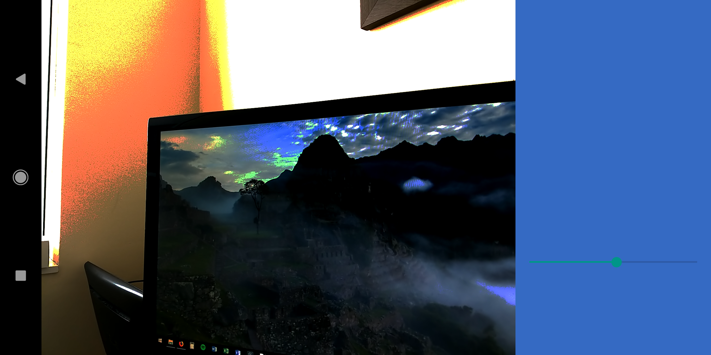
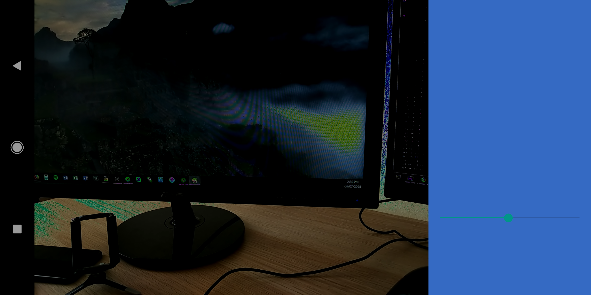

Android Camera2 Tonemap Issue Test
===================================

This sample app is based in the Camera2Basic sample. It has been made to demonstrate a problem when using a TonemapCurve with the Camera2 API.

Introduction
------------

TonemapCurve allows us to load a personalized Gamma Curve into the camera sensor. In this example I'm using a linear curve to make things simpler:

float[] LINEAR_CURVE = { 0.0000f, 0.0000f, 1.0000f, 1.0000f };

TonemapCurve tonemapCurve = new TonemapCurve(curve,curve,curve);

mRequestBuilder.set(CaptureRequest.TONEMAP_MODE, CameraMetadata.TONEMAP_MODE_CONTRAST_CURVE);

mRequestBuilder.set(CaptureRequest.TONEMAP_CURVE, tonemapCurve);
					
The first two numbers are the X and Y of the first point (Black) and the last two are the X and Y of the last point (white). Camera2 API will interpolate the intermediate values linearly between these two points. The camera sensor already uses a linear curve internally, so this provided curve does exactly nothing to the sensor (X and Y are the same).

Now, let's imagine we want to clamp the whites, so the maximum white value is 0.5 (128) instead of 1.0 (256). In order to do that we use this curve instead:

float[] LINEAR_CURVE = { 0.0000f, 0.0000f, 1.0000f, 0.5000f };

When doing this you should be able to appreciate some color artifacts: 

 
 

Any other value different than 1.0 for the white point will show the problem.